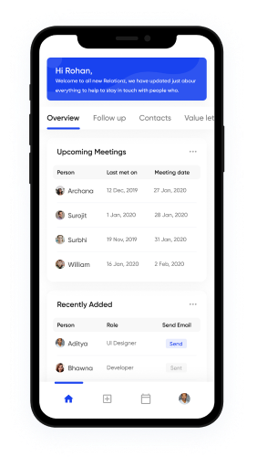

Web Laboratory works
<h1>Lab 1</h1> 
1. Simple landing page 
Description: Create a landing page following the given design (Figma).
Requirements: 
● Use of semantic tags (header, nav, ul, footer, etc.) 
wherever is necessary  
● All fonts, colour palette, elements sizes must strictly match the 
design. 
● Pixel perfect is also not required, BUT your website should visually 
match the design template (i.e. If the element is horizontally centred 
on the design, it should look centred on the website) 
● All class names must not be meaningless (i.e. class=”myClass”) and
should follow the same naming convention, preferably BEM, but 
you could come up with your own (just be consistent) 
● Basic cross-browser support (website should look correctly on last 
versions of modern browsers (Chrome, Safari, Edge) 
● For now, responsiveness is not required. 
P.S If your semester project has a landing website that satisfies the requirements, 
then you could skip this work by bringing your website for an assessment.
Note: The above goes only for those students. who were actually responsible for the 
website development. The whole team cannot use the right to skip this work! 
<a href="https://www.figma.com/file/ZM6o4UFoZUq9Kup8NjV94p/LabWork1-V10">
    
Link to figma task:

    
</a>

<a href="https://pashtetollo.github.io/Lab1/index.html">
    
Link to landing page on github pages:

    
</a>
